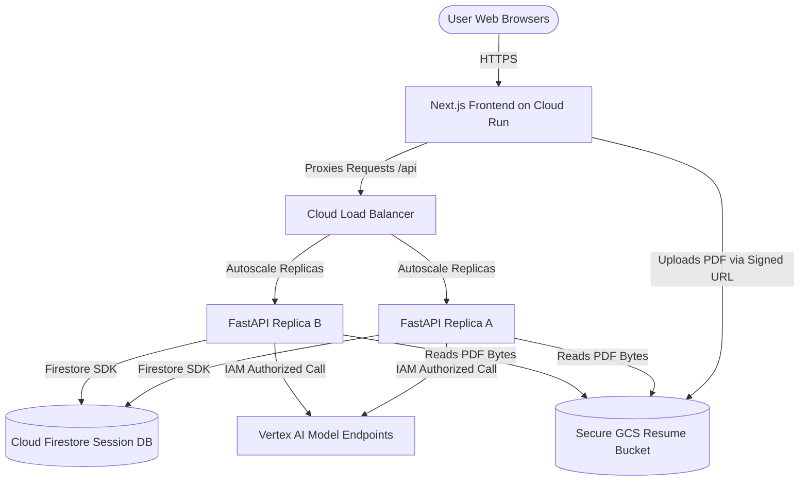

# Production Readiness Plan: JobApplicationAgent

This document outlines the architectural changes and cloud infrastructure requirements necessary to scale the `JobApplicationAgent` from a local pair-programming utility to a public-facing multi-user service.

---

## 1. Architecture Comparison: Development vs. Production

The following table contrasts the current local configuration with the target production setup:

| Architectural Component | Local Development (Current) | Production Release (Target) | Impact / Rationale |
| :--- | :--- | :--- | :--- |
| **Session Persistence** | In-Memory (lost on restarts) | Cloud Firestore (Serverless SQL/NoSQL) | Prevents session loss when uvicorn container instances autoscale or restart. |
| **Resume PDF Storage** | Local Disk (`tmp_uploads/`) | Google Cloud Storage (GCS) Bucket | Allows stateless container replicas to access uploaded resumes securely. |
| **LLM Provider** | Gemini Developer API Key | Vertex AI Model Endpoints | Increases rate limits (RPM/TPM) and provides enterprise SLAs and data guarantees. |
| **Server Scaling** | Single process (localhost) | Cloud Run (Serverless Autoscaling) | Handles sudden spikes in traffic concurrently and scales down to zero to save costs. |
| **Secrets Management** | Local Environment Variables | Google Cloud Secret Manager | Secures sensitive API keys and database credentials without exposing them in source code. |

---

## 2. Target Production Architecture

The system topology below illustrates how multi-user requests flow through stateless containers and connect to persisted cloud assets:



---

## 3. Required Implementation Steps

### Step A: Configure Persistent Session Storage
To ensure that a user's session state (profile, fit scores, drafts) is not lost when containers scale down or restart:
1. Enable the Firestore API in your Google Cloud Project.
2. Initialize Firestore in Native Mode.
3. Update [fast_api_app.py](file:///home/tarter/git/google/job-application-agent/app/fast_api_app.py) to point to the Cloud Firestore session backend:
   ```python
   # Set Firestore URI for session persistence
   session_service_uri = "firestore://YOUR_GCP_PROJECT_ID/sessions"
   ```

### Step B: Migrate to Google Cloud Storage (GCS)
Since local disk storage (`tmp_uploads/`) cannot be shared across multiple container instances:
1. Create a private Google Cloud Storage bucket (e.g., `job-app-resumes-prod`).
2. Implement **Signed URLs** in Next.js:
   * Instead of uploading file binaries directly to the Next.js server, the frontend requests a temporary write-only signed GCS URL from the backend.
   * The browser uploads the PDF directly and securely to GCS.
3. Pass the GCS URL (`gs://job-app-resumes-prod/unique-session-id.pdf`) to the agent setup node instead of a local file path.
4. Update `setup_candidate` in `app/nodes/setup.py` to check for `gs://` prefixes, using the Google Cloud Storage SDK to read the file bytes.

### Step C: Migrate to Vertex AI and Manage Quotas
To handle production traffic without hitting rate limits:
1. Replace the developer Gemini SDK initialization with Vertex AI authentication:
   ```python
   from google.cloud import aiplatform
   # Vertex AI automatically utilizes the service account credentials of the Cloud Run instance
   ```
2. Request a quota increase in the Google Cloud Console for the Gemini models (e.g., `gemini-1.5-flash` and `gemini-1.5-pro` API requests/minute).

### Step D: Secure Secrets with Secret Manager
1. Avoid committing secrets or service account keys to source control.
2. Save credentials in **Google Cloud Secret Manager**.
3. Mount the secrets as environment variables directly inside the Cloud Run deployment configuration.

---

## 4. Telemetry and Telemetry Monitoring

To monitor application health, costs, and token consumption in production:
1. **Google Cloud Trace & Logging**: The current [fast_api_app.py](file:///home/tarter/git/google/job-application-agent/app/fast_api_app.py) is already instrumented with `setup_telemetry()`. This sends OpenTelemetry traces directly to Google Cloud Trace.
2. **Alerting**: Configure alert thresholds in Google Cloud Monitoring to notify the team if the API error rate exceeds 1% or if Gemini API latency spikes above 10 seconds.
